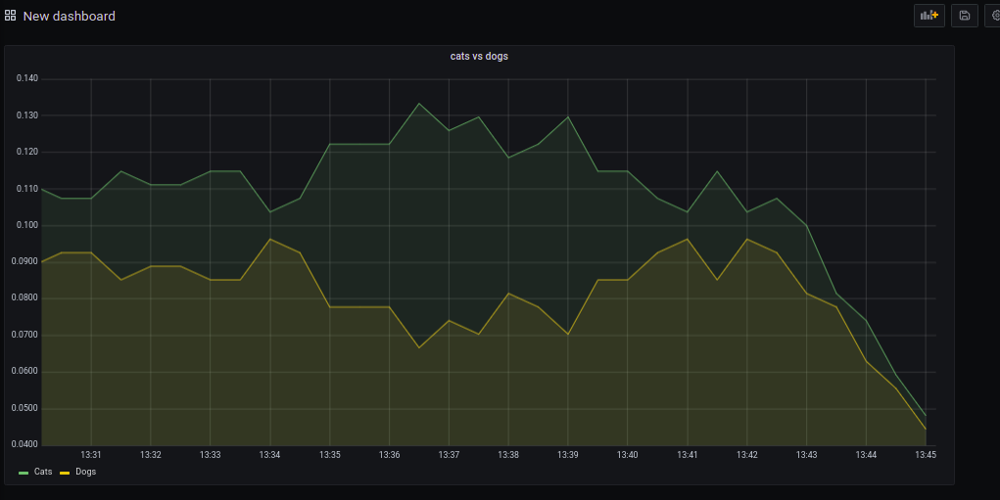

Proof of completion:

---

How to run the project:

k3d cluster create --port '8081:30080@agent[0]' -p 8082:80@loadbalancer --agents 2

helm repo add prometheus-community https://prometheus-community.github.io/helm-charts
helm repo add stable https://charts.helm.sh/stable
kubectl create namespace prometheus
helm install prometheus-community/kube-prometheus-stack --generate-name --namespace prometheus

helm upgrade --set prometheus.prometheusSpec.podMonitorSelectorNilUsesHelmValues=false --set prometheus.prometheusSpec.serviceMonitorSelectorNilUsesHelmValues=false prometheus prometheus-community/kube-prometheus-stack

helm upgrade --namespace prometheus --set prometheus.prometheusSpec.podMonitorSelectorNilUsesHelmValues=false --set prometheus.prometheusSpec.serviceMonitorSelectorNilUsesHelmValues=false kube-prometheus-stack-[XXXXX] prometheus-community/kube-prometheus-stack

kubectl get pods -n prometheus
kubectl -n prometheus port-forward kube-prometheus-stack-[XXXXX]-grafana-[XXXXX] 3000
kubectl -n prometheus port-forward prometheus-kube-prometheus-stack-[XXXXX]-prometheus-0 9090:9090

kubectl apply -f ./manifests

Add grafana dashboard with metrics: rate(cat_view_counter[5m]), rate(dog_view_counter[5m])

Spam F5 at http://localhost:8081/random
